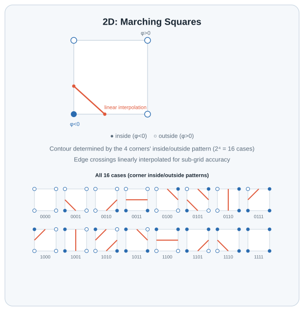

# levelset2d_bilinear_measure

Docs, examples, and Python bindings for comparing 2D level-set-derived
geometry (`ns_cg::Edge2d`) against the raw bilinear field it was
extracted from -- e.g. finding where a probe line crosses a polygon's
boundary segments vs. where the bilinear interpolant itself crosses
zero. The measurement primitives themselves
(`BilinearValue`/`FindBilinearCrossings`,
`RaySegmentIntersect`/`FindPolygonCrossings`) now live in
[`common_geometry`](../common_geometry) (`ns_cg::`), consolidated there
alongside the 3D analogs `levelset3d_trilinear_measure` uses -- this
project re-exports them (see
`include/levelset2d_bilinear_measure/levelset2d_bilinear_measure.hpp`)
and builds the docs/Python layer on top.

Depends only on [`common_geometry`](../common_geometry) -- not on
`levelset2d_polygon` -- and operates purely on already-extracted geometry
(a list of segments, corner values, etc.) passed in by the caller. It
doesn't know how to run marching squares or any other extraction
algorithm itself; that stays the extracting project's job.

The 3D counterpart,
[`levelset3d_trilinear_measure`](../levelset3d_trilinear_measure), is a
separate project (not just a namespace split): it operates on
`ns_cg::Mesh3d` and trilinear fields instead, and its own findings differ
in kind, not just in dimension -- see "What's here" below for why this
project's saddle case never produces the topological disagreement that
one documents.

## Background: Marching Squares case topology



The 16 corner-sign combinations shown here are exactly the `case_index`
values `levelset2d_polygon`'s `MarchCell` switches on (see
`detail/marching_squares.hpp`), and `common_geometry`'s
`bilinear.hpp`/`polygon_intersection.hpp` are the measurement primitives
for comparing that fixed-topology extraction against the raw bilinear
field it came from -- see `docs/polygon_vs_bilinear_probe.html` below
for that comparison, fully interactive.

## Requirements

- CMake >= 3.20
- A C++17 compiler
- [Eigen3](https://eigen.tuxfamily.org/) (e.g. `brew install eigen` on macOS)
- A sibling checkout of [`common_geometry`](../common_geometry) at
  `../common_geometry` relative to this repository

## Building and testing

```sh
cmake -B build -DCMAKE_BUILD_TYPE=Debug
cmake --build build
cd build && ctest --output-on-failure
```

## What's here

The measurement primitives live in `common_geometry` now; this project
re-exports them under their original names via
`levelset2d_bilinear_measure.hpp`, so downstream code and the Python
bindings below don't need to change:

- `ns_cg::BilinearValue` (4 corner values -> value at any point) and
  `ns_cg::FindBilinearCrossings` (every zero-crossing of that
  interpolant along an arbitrary probe line, via dense sampling +
  bisection -- works for any line direction, since the interpolant
  restricted to a line is a quadratic in general, not just the linear
  case an axis-aligned probe degenerates to).
- `ns_cg::RaySegmentIntersect` (2D ray-segment intersection) and
  `ns_cg::FindPolygonCrossings` (every crossing of a probe line against
  a `std::vector<ns_cg::Edge2d>` -- the raw segment soup
  `levelset2d_polygon`'s `MarchCell` emits, before it's linked into
  closed loops).

[`docs/polygon_vs_bilinear_probe.html`](docs/polygon_vs_bilinear_probe.html)
visualizes both, on a single grid cell whose four corner values are each
independently slider-controlled: drag a horizontal probe line across the
cell and watch the two methods' crossing positions pull apart, then a
chart of that same crossing position swept continuously across the full
probe range. Every corner-sign combination runs through the same full
16-case `MarchCell` switch `levelset2d_polygon` itself uses (not just the
saddle case this page used to hardcode) -- including, for the two
ambiguous saddle cases (5 and 10), the true cell-center-value
disambiguation. That's why, unlike
`levelset3d_trilinear_measure`'s fixed marching-cubes triangulation,
`levelset2d_polygon`'s marching squares always resolves any saddle
ambiguity correctly: the two methods disagree only on *where* the
crossing is, never on *whether* one exists, no matter how the four
corners are set. (This page's JS reproduces this library's exact math --
see "Python bindings" below for how that's verified, not just asserted.)


*Shown with corners `v0=-2.00, v1=1.00, v2=-2.00, v3=1.00` (the classic saddle case), probe at `y = 0.15`. Want to set each corner and sweep the probe yourself?* [**Open it live**](https://k-naeba.github.io/levelset2d_bilinear_measure/polygon_vs_bilinear_probe.html).

The "crossing position as the probe sweeps" chart from this page, on its own, for two
saddle configurations along the classic `v0=v2=-s, v1=v3=1` family (still fully reachable
via the corner sliders). First, at `s = 0.90`, just shy of the interesting threshold -- an
easier read to get oriented: both curves trace roughly the same rise, but pull apart
noticeably around the middle, and each has its own height range where it finds no crossing
at all.


Now push `s` to exactly `1.00` -- the asymptotic-decider threshold itself -- and the gap
becomes as large as it ever gets. At `s = 1` the bilinear field factors into
`(2x-1)(1-2y)`, so the true crossing freezes at `x = 0.5` for the *entire* sweep, while the
polygon's straight-edge approximation still swings across almost the full width of the cell.


This page is self-contained (no build step, no server) and served
directly from this repo's `docs/` folder via
[GitHub Pages](https://k-naeba.github.io/levelset2d_bilinear_measure/); it
also still works if you just open the file locally in a browser (or
download it straight from this repo).

Worth noting: the page above sweeps a *horizontal* probe, where the
polygon and bilinear field never disagree on whether a crossing exists.
Along the *diagonal* probe instead (corner 0 to corner 2 -- the harder
case, and the one where `levelset3d_trilinear_measure`'s fixed
triangulation fails), this library's own test suite
(`python/tests/test_bindings.py`) verifies that the two methods *still*
never disagree: `MarchCell`'s center-value disambiguation flips to a
segment pairing that runs parallel to the diagonal (zero crossings) at
exactly the same `s` where the bilinear field itself becomes connected.

## Python bindings

A [pybind11](https://github.com/pybind/pybind11) module (`_levelset2d_bilinear_measure`,
re-exported as `levelset2d_bilinear_measure`) exposes this library's C++ API to
Python for interactive analysis in Jupyter, built via
[scikit-build-core](https://github.com/scikit-build/scikit-build-core).

Scoped exactly like the C++ side: `common_geometry` types (`Edge2d`) and
the measurement functions common_geometry now implements
(`bilinear_value`, `find_bilinear_crossings`, `ray_segment_intersect`,
`find_polygon_crossings`) only -- no extraction algorithm (no marching
squares) is bound or depended on here. A small pure-Python helper module,
`known_cases`, fills the resulting gap for demos: it hand-reconstructs
`levelset2d_polygon`'s `MarchCell` case 1 (single inside corner, no
saddle) and case 5 (the face-saddle, including its true center-value
disambiguation) directly from the corner-value interpolation formula,
without calling any extraction library. This is verified (see
`python/tests/test_bindings.py`) against hand-derived closed-form
crossing positions along the cell diagonal.

### Install

```sh
uv venv --python 3.12 .venv
uv pip install --python .venv/bin/python -e ".[notebook]"
```

(Any Python >= 3.10 works; `uv venv --python 3.12` is just a known-good
pin for the notebook/Plotly/NumPy wheel stack at time of writing.)

### Usage

```python
import numpy as np
import levelset2d_bilinear_measure as lbm

v = [-1.0, 1.0, 1.0, -1.0]
lbm.find_bilinear_crossings(v, np.array([0.0, 0.3]), np.array([1.0, 0.0]))
# -> [0.5]
```

### Notebook

Not included yet -- `levelset3d_trilinear_measure/python/notebooks/exploration.ipynb`
is the pattern to follow if/when this project grows one (slider-driven
`ipywidgets`, built on `known_cases` + `plotting`). Left as a follow-up
since nothing here depends on it today.

This project is the 2D sibling of
[`levelset3d_trilinear_measure`](../levelset3d_trilinear_measure) (itself
a rename of the old `levelset_metrology`, split in two once it became
clear the 2D side had never actually been a real C++/Python library --
just JavaScript inline in a doc page). Both follow the same shape
(`bilinear.hpp`/`trilinear.hpp`, `known_cases`, `plotting`) deliberately,
even though their underlying math and findings differ.
