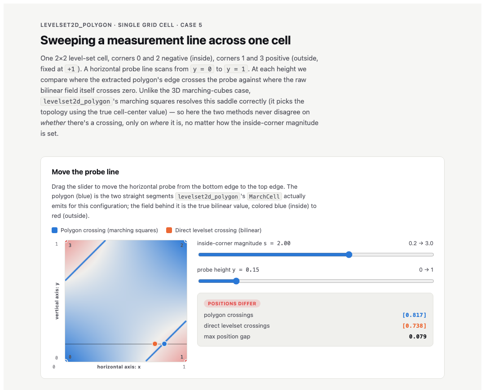
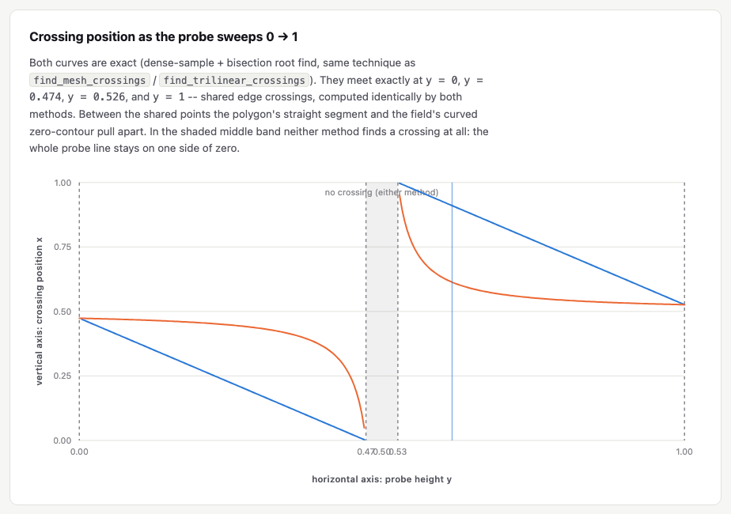
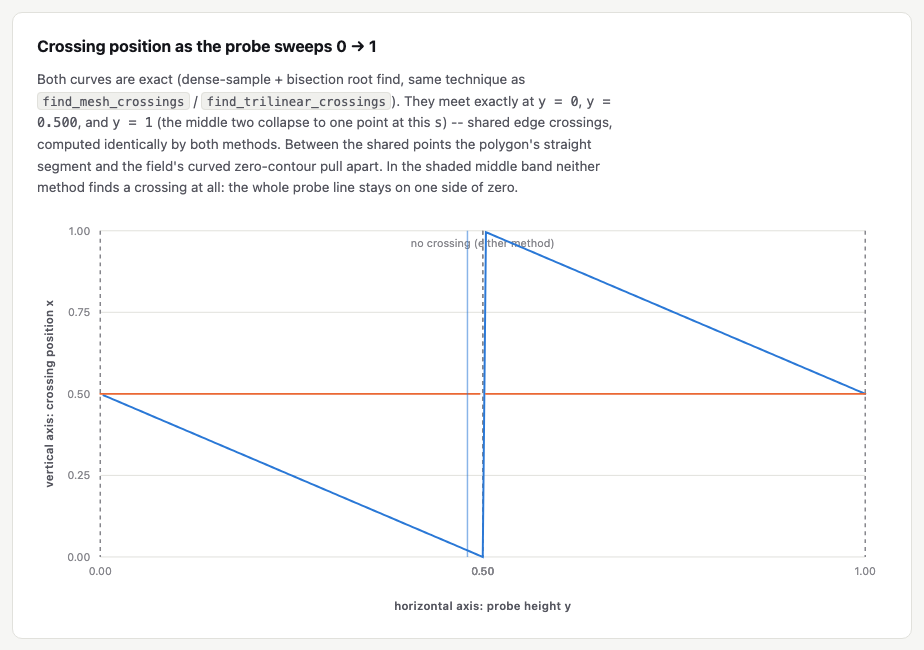

# levelset2d_bilinear_measure

A C++17 header-only library of measurement/comparison primitives for 2D
level-set-derived geometry (`ns_cg::Edge2d`) -- e.g. finding where a probe
line crosses a polygon's boundary segments, and comparing that against
the raw bilinear interpolant the boundary was extracted from.

Depends only on [`common_geometry`](../common_geometry) -- not on
`levelset2d_polygon` -- and operates purely on already-extracted geometry
(a list of segments, corner values, etc.) passed in by the caller. It
doesn't know how to run marching squares or any other extraction
algorithm itself; that stays the extracting project's job.

The 3D counterpart,
[`levelset3d_trilinear_measure`](../levelset3d_trilinear_measure), is a
separate project (not just a namespace split): it operates on
`ns_cg::Mesh3d` and trilinear fields instead, and its own findings differ
in kind, not just in dimension -- see "What's here" below for why this
project's saddle case never produces the topological disagreement that
one documents.

## Requirements

- CMake >= 3.20
- A C++17 compiler
- [Eigen3](https://eigen.tuxfamily.org/) (e.g. `brew install eigen` on macOS)
- A sibling checkout of [`common_geometry`](../common_geometry) at
  `../common_geometry` relative to this repository

## Building and testing

```sh
cmake -B build -DCMAKE_BUILD_TYPE=Debug
cmake --build build
cd build && ctest --output-on-failure
```

## What's here

- `bilinear.hpp`: `BilinearValue` (4 corner values -> value at any point)
  and `FindBilinearCrossings` (every zero-crossing of that interpolant
  along an arbitrary probe line, via dense sampling + bisection -- works
  for any line direction, since the interpolant restricted to a line is a
  quadratic in general, not just the linear case an axis-aligned probe
  degenerates to).
- `polygon_intersection.hpp`: `RaySegmentIntersect` (2D ray-segment
  intersection) and `FindPolygonCrossings` (every crossing of a probe
  line against a `std::vector<ns_cg::Edge2d>` -- the raw segment soup
  `levelset2d_polygon`'s `MarchCell` emits, before it's linked into
  closed loops).

[`docs/polygon_vs_bilinear_probe.html`](docs/polygon_vs_bilinear_probe.html)
visualizes both, on a single grid cell where corners 0 and 2 are inside
(negative, magnitude `s`) and corners 1, 3 are outside (fixed at `+1`):
drag a horizontal probe line across the cell and watch the two methods'
crossing positions pull apart, then a chart of that same crossing
position swept continuously across the full probe range. A second slider
exposes the inside-corner magnitude `s` itself -- `MarchCell`'s topology
branch flips at `s = 1` (which corner pair the two segments connect), but
the two shared-boundary heights stay at `min(s, 1)/(1+s)` and
`max(s, 1)/(1+s)` either way, so unlike
`levelset3d_trilinear_measure`'s fixed marching-cubes triangulation,
`levelset2d_polygon`'s marching squares always resolves the saddle
ambiguity correctly (via the true cell-center value): the two methods
disagree only on *where* the crossing is, never on *whether* one exists,
for any `s`. (This page's JS reproduces this library's exact math --
see "Python bindings" below for how that's verified, not just asserted.)



*Shown at `s = 2.00`, `y = 0.15`. Want to sweep the probe and the corner magnitude yourself?* [**Open it live**](https://k-naeba.github.io/levelset2d_bilinear_measure/polygon_vs_bilinear_probe.html).

The "crossing position as the probe sweeps" chart from this page, on its own. First, at
`s = 0.90`, just shy of the interesting threshold -- an easier read to get oriented: both
curves trace roughly the same rise, but pull apart noticeably around the middle before the
gap band, where the polygon's straight edge dives to `x = 0` while the bilinear crossing
eases off more gradually.



Now push `s` to exactly `1.00` -- the asymptotic-decider threshold itself -- and the gap
becomes as large as it ever gets. At `s = 1` the bilinear field factors into
`(2x-1)(1-2y)`, so the true crossing freezes at `x = 0.5` for the *entire* sweep, while the
polygon's straight-edge approximation still swings across almost the full width of the cell.



This page is self-contained (no build step, no server) and served
directly from this repo's `docs/` folder via
[GitHub Pages](https://k-naeba.github.io/levelset2d_bilinear_measure/); it
also still works if you just open the file locally in a browser (or
download it straight from this repo).

Worth noting: the page above sweeps a *horizontal* probe, where the
polygon and bilinear field never disagree on whether a crossing exists.
Along the *diagonal* probe instead (corner 0 to corner 2 -- the harder
case, and the one where `levelset3d_trilinear_measure`'s fixed
triangulation fails), this library's own test suite
(`python/tests/test_bindings.py`) verifies that the two methods *still*
never disagree: `MarchCell`'s center-value disambiguation flips to a
segment pairing that runs parallel to the diagonal (zero crossings) at
exactly the same `s` where the bilinear field itself becomes connected.

## Python bindings

A [pybind11](https://github.com/pybind/pybind11) module (`_levelset2d_bilinear_measure`,
re-exported as `levelset2d_bilinear_measure`) exposes this library's C++ API to
Python for interactive analysis in Jupyter, built via
[scikit-build-core](https://github.com/scikit-build/scikit-build-core).

Scoped exactly like the C++ library itself: `common_geometry` types
(`Edge2d`) and this project's own functions
(`bilinear_value`, `find_bilinear_crossings`, `ray_segment_intersect`,
`find_polygon_crossings`) only -- no extraction algorithm (no marching
squares) is bound or depended on here. A small pure-Python helper module,
`known_cases`, fills the resulting gap for demos: it hand-reconstructs
`levelset2d_polygon`'s `MarchCell` case 1 (single inside corner, no
saddle) and case 5 (the face-saddle, including its true center-value
disambiguation) directly from the corner-value interpolation formula,
without calling any extraction library. This is verified (see
`python/tests/test_bindings.py`) against hand-derived closed-form
crossing positions along the cell diagonal.

### Install

```sh
uv venv --python 3.12 .venv
uv pip install --python .venv/bin/python -e ".[notebook]"
```

(Any Python >= 3.10 works; `uv venv --python 3.12` is just a known-good
pin for the notebook/Plotly/NumPy wheel stack at time of writing.)

### Usage

```python
import numpy as np
import levelset2d_bilinear_measure as lbm

v = [-1.0, 1.0, 1.0, -1.0]
lbm.find_bilinear_crossings(v, np.array([0.0, 0.3]), np.array([1.0, 0.0]))
# -> [0.5]
```

### Notebook

Not included yet -- `levelset3d_trilinear_measure/python/notebooks/exploration.ipynb`
is the pattern to follow if/when this project grows one (slider-driven
`ipywidgets`, built on `known_cases` + `plotting`). Left as a follow-up
since nothing here depends on it today.

This project is the 2D sibling of
[`levelset3d_trilinear_measure`](../levelset3d_trilinear_measure) (itself
a rename of the old `levelset_metrology`, split in two once it became
clear the 2D side had never actually been a real C++/Python library --
just JavaScript inline in a doc page). Both follow the same shape
(`bilinear.hpp`/`trilinear.hpp`, `known_cases`, `plotting`) deliberately,
even though their underlying math and findings differ.
